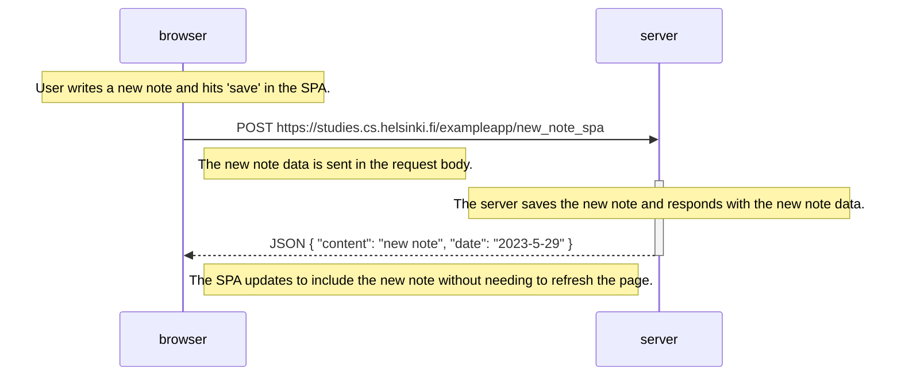

```mermaid
sequenceDiagram
    participant browser
    participant server
    
    Note over browser: User writes a new note and hits 'save' in the SPA.
    
    browser->>server: POST https://studies.cs.helsinki.fi/exampleapp/new_note_spa
    Note right of browser: The new note data is sent in the request body.
    activate server
    
    Note over server: The server saves the new note and responds with the new note data.
    server-->>browser: JSON { "content": "new note", "date": "2023-5-29" }
    deactivate server
    
    Note right of browser: The SPA updates to include the new note without needing to refresh the page.

```
